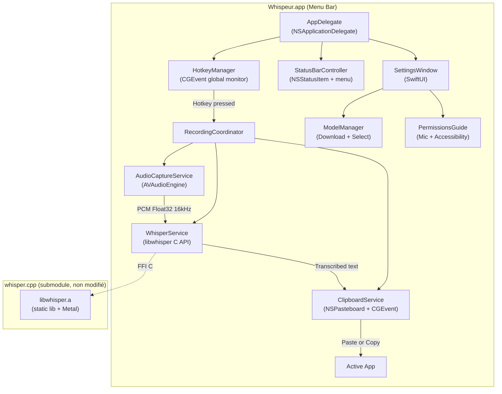
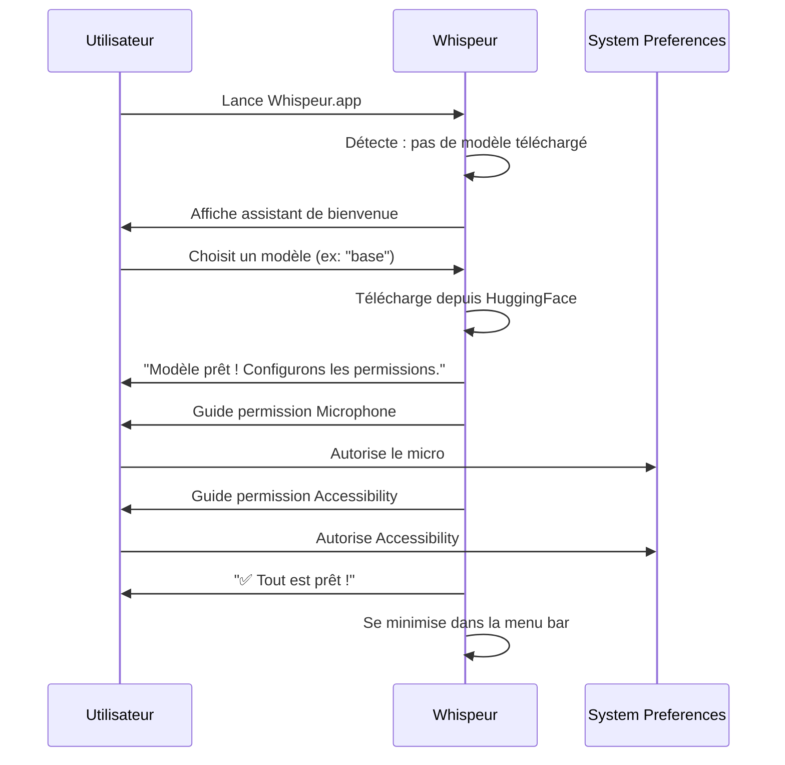
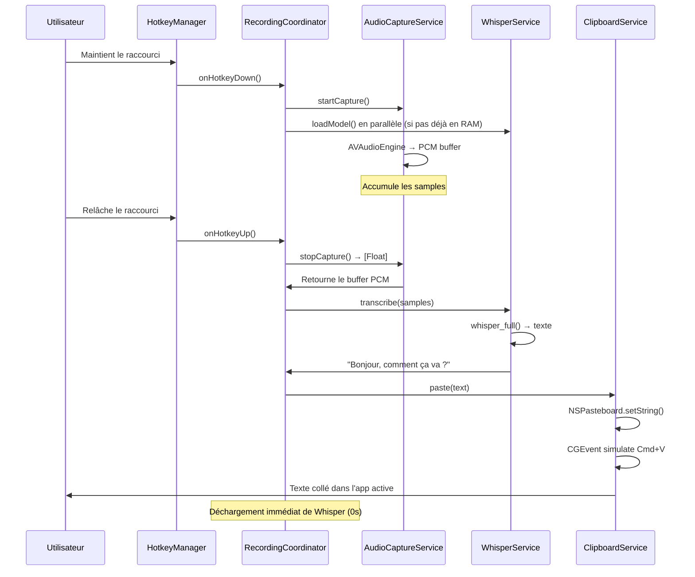
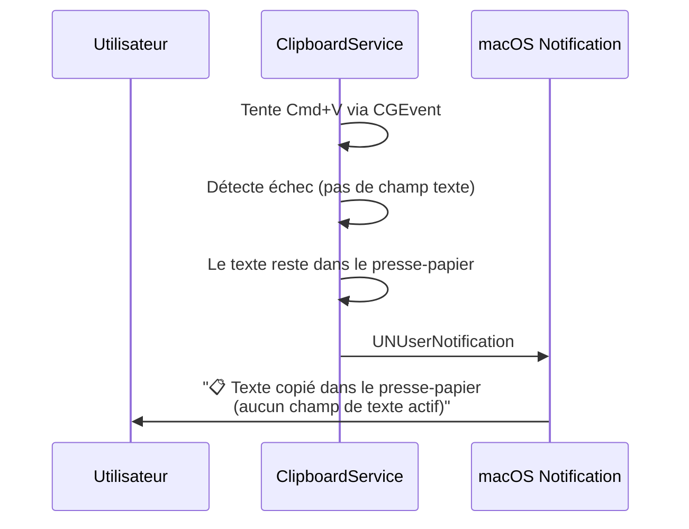

# Whispeur — Analyse complète & Plan Pré-Développement

---

## 🛑 Consignes de Code (Pour l'IA)
> [!IMPORTANT]
> **Règles absolues sur le code :**
> - **Code 100% Moderne (Swift 6) :** Utilise exclusivement les fonctionnalités de Swift 6. **ATTENTION :** Puisque le "Strict Concurrency Checking" est activé, tu devras faire très attention aux avertissements de Data Races et au protocole `Sendable`, notamment lors de l'interaction avec les pointeurs C non-sécurisés de `whisper.cpp` (utilise `@unchecked Sendable` ou des wrappers appropriés si nécessaire). N'utilise pas `DispatchQueue` (sauf contrainte forte Apple), privilégie `async/await` et les `actors`.
> - **Langue du code :** Le code source DOIT être 100% en Anglais (Noms de variables, fonctions, classes, commentaires techniques).
> - **Langue de l'interface :** Les textes affichés à l'écran (Text, alertes, boutons) doivent être en français.
> - **Communication :** Explique tes choix et tes étapes en français.

---

## 0. 📖 Fichier Guide pour l'IA (NOUVEAU)

> [!CAUTION]
> J'ai créé un fichier **`WHISPER_INTEGRATION_GUIDE.md`** à la racine de ton dossier `/Users/emilien/dev/perso/whispeur/`.
> Ce fichier est la **bible de développement** pour l'IA qui va coder. Il contient le condensé de l'analyse du code source de `whisper.cpp` (Metal vs CoreML, pièges audio, pointeurs vers les bons fichiers). **Donne l'ordre à l'IA de lire ce fichier avant de commencer.**

Les fichiers sources officiels dont l'IA devra s'inspirer (détaillés dans le guide) sont :
1. `build-xcframework.sh` (script de build)
2. `LibWhisper.swift` (le wrapper Swift)
3. `WhisperState.swift` (l'orchestrateur)
4. `Recorder.swift` & `RiffWaveUtils.swift` (le format audio)
5. `whisper.h` (l'API C complète)

### Fichier 1 : Le script de compilation XCFramework
**Chemin :** [build-xcframework.sh](file:///Users/emilien/dev/perso/whispeur/whisper.cpp/build-xcframework.sh)

**Pourquoi le lire :** C'est le script officiel qui compile `whisper.cpp` en framework Apple natif. Il faut comprendre sa structure pour écrire notre propre `build-whisper.sh` simplifié (macOS-only). Points clés à retenir :
- `GGML_METAL=ON` + `GGML_METAL_EMBED_LIBRARY=ON` → active l'accélération GPU Metal
- `GGML_METAL_USE_BF16=ON` → optimisation BFloat16 sur Apple Silicon
- `BUILD_SHARED_LIBS=OFF` → on veut une lib **statique** `.a`
- `WHISPER_BUILD_EXAMPLES=OFF` + `WHISPER_BUILD_TESTS=OFF` → on ne compile que la lib, pas les exemples
- `GGML_NATIVE=OFF` dans le script original (portabilité multi-arch) → nous on met `ON` car c'est pour notre Mac uniquement

---

### Fichier 2 : Le wrapper Swift (le plus important)
**Chemin :** [LibWhisper.swift](file:///Users/emilien/dev/perso/whispeur/whisper.cpp/examples/whisper.swiftui/whisper.cpp.swift/LibWhisper.swift)

**Pourquoi le lire :** C'est le modèle exact à suivre pour notre `WhisperService.swift`. Points clés :
- Utilise un **`actor`** Swift pour la thread-safety (whisper n'est pas thread-safe pour un même contexte)
- `whisper_context_default_params()` → `params.use_gpu = true` + `params.flash_attn = true` pour Metal
- `whisper_init_from_file_with_params(path, params)` pour charger le modèle
- `whisper_full(context, params, samples.baseAddress, Int32(samples.count))` pour transcrire
- Récupère le texte via une boucle `whisper_full_n_segments()` + `whisper_full_get_segment_text()`
- L'import est `import whisper` (le module du XCFramework)

> [!WARNING]
> **Adaptation requise :** Ce fichier importe `UIKit` (c'est un exemple iOS). Notre version doit importer `AppKit` à la place. Le reste de l'API whisper est identique.

---

### Fichier 3 : L'orchestrateur (flux enregistrement → transcription)
**Chemin :** [WhisperState.swift](file:///Users/emilien/dev/perso/whispeur/whisper.cpp/examples/whisper.swiftui/whisper.swiftui.demo/Models/WhisperState.swift)

**Pourquoi le lire :** Montre le flux complet : enregistrer → convertir → transcrire → afficher. Points clés :
- `@MainActor class` avec `@Published` pour le binding SwiftUI
- `loadModel()` charge le modèle depuis un fichier `.bin` au lancement
- `toggleRecord()` démarre/arrête l'enregistrement — pattern à adapter pour nos modes Push-to-Talk et Toggle
- `transcribeAudio()` → `readAudioSamples()` → `decodeWaveFile()` → `whisperContext.fullTranscribe(samples:)`
- Gestion de la permission micro avec `#if os(macOS)` qui retourne `true` directement (sur macOS la permission est gérée différemment)

> [!WARNING]
> **PIÈGE MAJEUR — Ne PAS reproduire l'approche audio de cet exemple tel quel.**
> L'exemple utilise `AVAudioRecorder` → écrit un fichier WAV sur disque → le relit avec `decodeWaveFile()`. C'est lent (I/O disque) et introduit de la latence.
> Notre app doit utiliser **`AVAudioEngine`** pour capturer le micro en streaming mémoire, et fournir directement le buffer `[Float]` à whisper sans passer par le disque. Voir section 2.3.

---

### Fichier 4 : Capture audio et conversion PCM
**Chemins :**
- [Recorder.swift](file:///Users/emilien/dev/perso/whispeur/whisper.cpp/examples/whisper.swiftui/whisper.swiftui.demo/Utils/Recorder.swift) — L'enregistreur audio
- [RiffWaveUtils.swift](file:///Users/emilien/dev/perso/whispeur/whisper.cpp/examples/whisper.swiftui/whisper.swiftui.demo/Utils/RiffWaveUtils.swift) — Décodeur WAV → Float

**Pourquoi les lire :** Ils révèlent les contraintes audio exactes de whisper.cpp :
- Format requis : **PCM linéaire, 16000 Hz, mono, 1 canal** (voir les `recordSettings` dans Recorder.swift : `AVSampleRateKey: 16000.0`, `AVNumberOfChannelsKey: 1`)
- `decodeWaveFile()` convertit les échantillons `Int16` en `Float` normalisé `[-1.0, 1.0]` via `Float(short) / 32767.0`
- Le WAV header fait 44 bytes → `stride(from: 44, ...)` saute le header

> [!IMPORTANT]
> **Ce qu'on garde :** Le format cible (16kHz, mono, Float32).
> **Ce qu'on ne garde PAS :** L'écriture sur disque. Notre `AudioCaptureService` utilisera `AVAudioEngine.inputNode.installTap()` qui fournit directement des `AVAudioPCMBuffer` qu'on convertit en `[Float]` en mémoire. Plus rapide, zéro I/O.

---

### Fichier 5 : L'en-tête C complet (la bible)
**Chemin :** [whisper.h](file:///Users/emilien/dev/perso/whispeur/whisper.cpp/include/whisper.h)

**Pourquoi le lire :** C'est la référence de TOUTE l'API. Points clés pour notre app :
- **Langues :** `whisper_lang_max_id()` retourne le nombre total de langues, `whisper_lang_str(id)` donne le code ("fr", "en"...), `whisper_lang_str_full(id)` donne le nom complet ("french", "english"...) → pour construire le picker de langue dynamiquement
- **Auto-détection langue :** `params.language = nullptr` ou `"auto"` + `params.detect_language = true`
- **VAD intégré (Silero) :** `whisper_vad_init_from_file_with_params()` + `whisper_vad_detect_speech()` → peut servir pour détecter automatiquement le silence et couper l'enregistrement
- **Callbacks :** `new_segment_callback` permet de recevoir le texte au fur et à mesure (streaming partiel), pas besoin d'attendre la fin complète
- **`whisper_full_params` :** Configure tout → langue, threads, timestamps, single_segment, suppress_blank, etc.
- **`WHISPER_SAMPLE_RATE = 16000`** → constante à utiliser pour la capture audio

---

### Fichiers bonus utiles (pas obligatoires mais référence)

| Fichier | Utilité |
|---|---|
| [Model.swift](file:///Users/emilien/dev/perso/whispeur/whisper.cpp/examples/whisper.swiftui/whisper.swiftui.demo/Models/Model.swift) | Struct `Model` simple (nom, URL, filename). S'en inspirer pour notre `WhisperModel.swift` |
| [ContentView.swift](file:///Users/emilien/dev/perso/whispeur/whisper.cpp/examples/whisper.swiftui/whisper.swiftui.demo/UI/ContentView.swift) L85-L119 | **Catalogue complet des modèles avec URLs HuggingFace exactes et tailles.** À copier directement pour notre `ModelManager` |
| [DownloadButton.swift](file:///Users/emilien/dev/perso/whispeur/whisper.cpp/examples/whisper.swiftui/whisper.swiftui.demo/UI/DownloadButton.swift) | Pattern de téléchargement avec `URLSessionDownloadTask` + observation du progress. Réutilisable directement |
| [download-ggml-model.sh](file:///Users/emilien/dev/perso/whispeur/whisper.cpp/models/download-ggml-model.sh) | Liste textuelle de tous les modèles. Source de vérité pour la liste complète |

---

## 1. Analyse du Cahier des Charges

### Verdict : ✅ Excellent et faisable à 100%

Le document est **remarquablement bien structuré** pour un cahier des charges personnel. La séparation "imposé vs à définir" est intelligente et donne à l'IA les bons degrés de liberté. Quelques points :

**Ce qui est très bien :**
- La vision est claire : minimaliste, ultra-rapide, local-only
- La contrainte `whisper.cpp` non modifié est bien pensée (maintenabilité)
- Les 2 modes (push-to-talk / bascule) sont bien identifiés
- La gestion des erreurs (notification si pas de champ actif) est un détail UX souvent oublié — bravo
- Le scope est raisonnable — pas de feature creep

**Points manquants que je complète ici :**

| Aspect | Décision proposée | Justification |
|---|---|---|
| Format de distribution | `.app` dans un `.dmg` signé | Standard macOS. Pas besoin du Mac App Store (permissions Accessibility = refus quasi certain) |
| Versioning | SemVer + git tag | Simple, compatible CI |
| Stockage des préférences | `UserDefaults` | Standard macOS, persisté automatiquement |
| Stockage des modèles | `~/Library/Application Support/Whispeur/models/` | Convention macOS, pas dans le bundle (modèles trop lourds) |
| Première installation | Assistant intégré (download modèle + permissions) | UX critique, l'utilisateur ne doit pas avoir à faire de terminal |
| Logs | `os.log` (unified logging) | Standard Apple, visible dans Console.app |
| Indicateur visuel pendant dictée | Petit point coloré dans la menu bar | Feedback essentiel pour savoir que ça enregistre |

---

## 2. Décisions Techniques (les 4 "[À DÉFINIR]")

### 2.1 Stack Technique : **Swift + SwiftUI (100% natif)**

**C'est le seul choix qui fait sens.** Pas d'alternative viable ici — voici pourquoi :

| Critère du cahier des charges | Swift natif | Tauri (Rust+Web) | Electron |
|---|:---:|:---:|:---:|
| Ultra-léger | ✅ ~5 MB | ⚠️ ~15-20 MB | ❌ ~150 MB |
| Accès Accessibility API (simulation frappe) | ✅ Natif | ❌ Limité | ❌ Limité |
| Raccourci clavier global | ✅ `CGEvent` / `addGlobalMonitor` | ⚠️ Complexe | ⚠️ Complexe |
| Menu bar app (pas de Dock) | ✅ `NSStatusItem` natif | ⚠️ Hack | ⚠️ Hack |
| Accès micro (AVFoundation) | ✅ Natif, 0 latence | ⚠️ Via bridge | ⚠️ Via browser API |
| Intégration `whisper.cpp` (C lib) | ✅ Swift ↔ C directement | ✅ Rust FFI | ❌ Node FFI lourd |
| Metal / GPU accélération | ✅ Transparent (CMake flag) | ✅ Via compilation | ✅ Via compilation |
| Maîtrise par l'IA (Claude) | ✅ Excellente | ✅ Bonne | ✅ Bonne |
| Notifications macOS | ✅ `UNUserNotificationCenter` | ⚠️ Via bridge | ⚠️ Via bridge |

> [!IMPORTANT]
> **Tauri n'est PAS une alternative viable ici.** Le cahier des charges exige un accès à l'Accessibility API macOS (pour simuler `Cmd+V` ou injecter du texte via `CGEvent`), un raccourci clavier global qui fonctionne *même quand l'app n'a pas le focus*, et une exécution en menu bar sans Dock. Ces 3 besoins sont des API purement macOS (AppKit/Carbon) qui nécessitent un accès natif. Tauri ajouterait une couche d'abstraction pour arriver au même résultat, mais en plus lourd, plus fragile, et plus difficile à débugger.

### 2.2 Communication avec whisper.cpp : **Intégration directe via `libwhisper` (linking statique)**

Trois options existent. Une seule est correcte :

| Méthode | Latence | Fiabilité | Complexité |
|---|:---:|:---:|:---:|
| **CLI subprocess** (`whisper-cli`) | ❌ ~500ms overhead (fork + load modèle) | ⚠️ Fragile (parsing stdout) | ✅ Simple |
| **Intégration `libwhisper`** | ✅ Faible (si lazy load) | ✅ API C stable | ⚠️ Moyenne |
| **Serveur HTTP local** (`whisper-server`) | ❌ ~100ms overhead réseau | ⚠️ Port occupé, firewall | ❌ Complexe |

**Choix : `libwhisper` intégrée comme bibliothèque statique.**

Justifications clés :
- L'API C de [whisper.h](file:///Users/emilien/dev/perso/whispeur/whisper.cpp/include/whisper.h) est **extrêmement propre** : `whisper_init_from_file_with_params()` → `whisper_full()` → `whisper_full_get_segment_text()` → `whisper_free()`
- L'exemple officiel [LibWhisper.swift](file:///Users/emilien/dev/perso/whispeur/whisper.cpp/examples/whisper.swiftui/whisper.cpp.swift/LibWhisper.swift) prouve que ça fonctionne
- Accélération matérielle **Metal** activée au build.

> [!CAUTION]
> **Gestion de la Mémoire RAM (TRÈS IMPORTANT) :**
> L'application doit être ULTRA légère en arrière-plan. Le modèle Whisper pèse de 150 Mo à 3 Go. **Il ne doit absolument PAS être chargé en permanence en mémoire.**
> - **Pas de préchargement :** Le modèle n'est JAMAIS chargé au lancement de l'application.
> - **Lazy-loading intelligent :** Le chargement en RAM du modèle se déclenche en arrière-plan *uniquement* lorsque l'utilisateur appuie sur le raccourci clavier pour commencer à dicter (ce temps de chargement de 1s est masqué par le temps où l'utilisateur parle).
> - **Déchargement immédiat (0 seconde) :** Dès que la transcription est terminée et le texte collé, le modèle est instantanément purgé (`whisper_free()`) pour libérer 100% de la RAM. Aucun cache n'est conservé pour maximiser l'économie de mémoire.

> [!NOTE]
> **Pourquoi pas CoreML (Neural Engine) ?**
> `whisper.cpp` supporte CoreML. Cependant, après analyse, cela nécessiterait de fournir ou faire télécharger à l'utilisateur des modèles pré-compilés au format `.mlmodelc` (ce que le script shell officiel ne fait pas directement, il requiert python). Metal utilise le GPU et est déjà ultra-performant (< 500ms). Le gain de CoreML ne justifie pas la complexité d'installation pour la V1.

### 2.3 Capture Audio : **AVFoundation gérée par le wrapper**

| Méthode | Pour | Contre |
|---|---|---|
| **App gère le micro** (AVFoundation `AVAudioEngine`) | Contrôle total (format, buffer size, VAD), pas de dépendance SDL | Plus de code à écrire |
| Utiliser l'outil `stream` de whisper.cpp | Moins de code | Dépendance SDL2, c'est un process séparé = on perd tous les avantages du linking direct, pas de contrôle fin |

**Choix : L'app capture elle-même le micro via `AVAudioEngine`.**

- `AVAudioEngine` fournit un flux PCM Float32 à 16kHz (exactement ce que whisper attend : `WHISPER_SAMPLE_RATE = 16000`)
- On peut implémenter un **VAD (Voice Activity Detection)** simple côté Swift pour ne transcrire que quand il y a du son (whisper.cpp v1.9.1 a même un [VAD intégré](file:///Users/emilien/dev/perso/whispeur/whisper.cpp/include/whisper.h#L676-L729) avec le modèle Silero)
- Pas de dépendance à SDL2 = une dépendance externe en moins
- Le format PCM Float32 mono 16kHz est trivial à obtenir via `AVAudioEngine.inputNode.installTap()`

> [!WARNING]
> **Différence critique avec l'exemple officiel :** [Recorder.swift](file:///Users/emilien/dev/perso/whispeur/whisper.cpp/examples/whisper.swiftui/whisper.swiftui.demo/Utils/Recorder.swift) utilise `AVAudioRecorder` qui écrit un fichier `.wav` sur le disque, puis [RiffWaveUtils.swift](file:///Users/emilien/dev/perso/whispeur/whisper.cpp/examples/whisper.swiftui/whisper.swiftui.demo/Utils/RiffWaveUtils.swift) le relit et convertit les `Int16` en `Float`. Ce flux file→read→convert ajoute de la latence inutile.
> Notre approche : `AVAudioEngine.inputNode.installTap(onBus:bufferSize:format:)` avec un format cible `AVAudioFormat(commonFormat: .pcmFormatFloat32, sampleRate: 16000, channels: 1, interleaved: false)`. Les samples arrivent directement en `[Float]` en mémoire → envoi direct à `whisper_full()`. Zéro I/O disque.

### 2.4 Stratégie de Mise à Jour whisper.cpp : **Git Submodule**

```
whispeur/
├── Whispeur/                    ← Code source Swift de l'app
│   ├── App/
│   ├── Views/
│   ├── Services/
│   └── ...
├── whisper.cpp/                 ← Git submodule (NE PAS TOUCHER)
├── build-whisper.sh             ← Script de compilation de la lib
├── Whispeur.xcodeproj
└── README.md
```

**Mécanisme :**
1. `whisper.cpp/` est un **git submodule** pointant vers le repo officiel
2. Pour mettre à jour : `cd whisper.cpp && git pull origin master && cd ..`
3. Puis recompiler : `./build-whisper.sh` (wrapper autour du CMake de whisper.cpp)
4. **Zéro conflit garanti** car on ne modifie AUCUN fichier dans `whisper.cpp/`
5. Le `.gitmodules` versionne le commit exact de whisper.cpp utilisé

> [!NOTE]
> Le dossier `whisper.cpp/` existant devra être converti en submodule git propre. C'est une opération simple : supprimer le dossier, faire `git submodule add https://github.com/ggerganov/whisper.cpp.git whisper.cpp`.

---

## 3. Architecture Détaillée

### 3.1 Vue d'ensemble



### 3.2 Composants Swift — Description détaillée

#### `AppDelegate` — Point d'entrée
- Configure l'app comme **LSUIElement** (pas d'icône Dock) via `Info.plist`
- Initialise tous les services au lancement
- **ATTENTION :** Ne charge PAS le modèle Whisper au lancement. Il laisse l'app dans un état de veille consommant quasi 0 RAM.

#### `HotkeyManager` — Raccourci clavier global
- Utilise `CGEvent.tapCreate()` pour intercepter les touches **même quand l'app n'a pas le focus**
- Supporte 2 modes :
  - **Push-to-Talk** : enregistre tant que la touche est maintenue
  - **Toggle** : 1er appui → début, 2e appui → fin
- Le raccourci est configurable et stocké dans `UserDefaults`

#### `StatusBarController` — Barre de menu
- `NSStatusItem` avec icône microphone
- Menu déroulant : Préférences, Changer de modèle, Quitter
- **Changement visuel pendant l'enregistrement** (icône rouge pulsante ou point coloré)

#### `AudioCaptureService` — Capture micro
- `AVAudioEngine.inputNode.installTap()` pour capturer le flux audio
- Conversion automatique vers PCM Float32 mono 16kHz (format whisper)
- Buffer circulaire pour accumuler les échantillons

#### `WhisperService` — Interface avec whisper.cpp
- Wrapper Swift autour de l'API C de [whisper.h](file:///Users/emilien/dev/perso/whispeur/whisper.cpp/include/whisper.h)
- Chargement du modèle via `whisper_init_from_file_with_params()` (Lazy load)
- Transcription via `whisper_full()` avec les paramètres optimaux
- Utilise un `actor` Swift pour la thread-safety
- Configuration : langue, nombre de threads, etc.
- Active `flash_attn = true` et `use_gpu = true` pour Metal

#### `ClipboardService` — Collage intelligent
- **Mode Copie** : `NSPasteboard.general.setString(text)`
- **Mode Collage automatique** : 
  1. Copie dans le presse-papier
  2. Simule `Cmd+V` via `CGEvent` (nécessite Accessibility)
  3. Si échec (pas de champ de texte actif) → notification macOS via `UNUserNotificationCenter`

#### `ModelManager` — Gestion des modèles
- Téléchargement depuis HuggingFace
- Liste dynamique des modèles disponibles
- Stockage dans `~/Library/Application Support/Whispeur/models/`

#### `SettingsWindow` — Interface SwiftUI
- **Onglet Raccourci** : Capteur de touche + choix du mode (Push-to-Talk / Toggle)
- **Onglet Modèles** : Liste avec statut, bouton download, sélection active
- **Onglet Langue** : Picker avec "Auto" + toutes les langues supportées
- **Onglet Permissions** : Checklist avec boutons "Ouvrir les Préférences Système" pour Micro et Accessibility

#### `PermissionsGuide` — Assistant permissions
- Détecte l'état actuel des permissions (Micro via `AVCaptureDevice.authorizationStatus`, Accessibility via `AXIsProcessTrusted()`)
- Guide pas à pas avec deep links vers les Préférences Système (`x-apple.systempreferences:`)

### 3.3 Arborescence complète du projet

```
whispeur/
├── whisper.cpp/                          ← Git submodule (NE PAS TOUCHER)
│
├── Whispeur/
│   ├── App/
│   │   ├── WhispeurApp.swift             ← @main, point d'entrée SwiftUI
│   │   ├── AppDelegate.swift             ← NSApplicationDelegate, init services
│   │   └── Info.plist                    ← LSUIElement=true, permissions descriptions
│   │
│   ├── Services/
│   │   ├── HotkeyManager.swift           ← Raccourci clavier global (CGEvent)
│   │   ├── AudioCaptureService.swift     ← Capture micro (AVAudioEngine)
│   │   ├── WhisperService.swift          ← Interface whisper.cpp (actor Swift)
│   │   ├── ClipboardService.swift        ← Copie/Collage (NSPasteboard + CGEvent)
│   │   ├── ModelManager.swift            ← Téléchargement/gestion modèles
│   │   ├── PermissionService.swift       ← Vérification permissions macOS
│   │   └── RecordingCoordinator.swift    ← Orchestre le flux : hotkey → audio → whisper → paste
│   │
│   ├── Views/
│   │   ├── StatusBarView.swift           ← Menu bar (NSStatusItem)
│   │   ├── SettingsView.swift            ← Fenêtre paramètres (SwiftUI)
│   │   ├── HotkeySettingsTab.swift       ← Onglet raccourci
│   │   ├── ModelSettingsTab.swift         ← Onglet modèles
│   │   ├── LanguageSettingsTab.swift      ← Onglet langue
│   │   └── PermissionsSettingsTab.swift   ← Onglet permissions
│   │
│   ├── Models/
│   │   ├── WhisperModel.swift            ← Struct pour un modèle (nom, taille, URL, état)
│   │   ├── AppSettings.swift             ← @AppStorage wrapper pour UserDefaults
│   │   └── RecordingMode.swift           ← Enum PushToTalk / Toggle
│   │
│   ├── Utilities/
│   │   ├── Logger.swift                  ← Wrapper os.log
│   │   └── Constants.swift               ← URLs, chemins, valeurs par défaut
│   │
│   └── Bridge/
│       └── WhisperBridge.h               ← Bridging header C → Swift
│
├── WhispeurTests/
│   ├── WhisperServiceTests.swift
│   ├── AudioCaptureTests.swift
│   └── ModelManagerTests.swift
│
├── Whispeur.xcodeproj/
├── build-whisper.sh                      ← Script compilation libwhisper
├── .gitmodules                           ← Référence submodule whisper.cpp
├── README.md
├── LICENSE
└── Makefile                              ← Commandes pratiques (build, clean, update-whisper)
```

### 3.4 Script `build-whisper.sh`

Ce script compile `whisper.cpp` en bibliothèque statique pour macOS Apple Silicon avec Metal :

```bash
#!/bin/bash
set -e

WHISPER_DIR="$(dirname "$0")/whisper.cpp"
BUILD_DIR="$(dirname "$0")/build-whisper"

mkdir -p "$BUILD_DIR"
cd "$BUILD_DIR"

cmake "$WHISPER_DIR" \
    -DCMAKE_BUILD_TYPE=Release \
    -DBUILD_SHARED_LIBS=OFF \
    -DWHISPER_BUILD_EXAMPLES=OFF \
    -DWHISPER_BUILD_TESTS=OFF \
    -DWHISPER_BUILD_SERVER=OFF \
    -DGGML_METAL=ON \
    -DGGML_METAL_EMBED_LIBRARY=ON \
    -DGGML_METAL_USE_BF16=ON \
    -DGGML_NATIVE=ON \
    -DCMAKE_OSX_ARCHITECTURES=arm64

cmake --build . --config Release -j$(sysctl -n hw.logicalcpu)

echo "✅ libwhisper.a compilée dans $BUILD_DIR/bin/"
```

---

## 4. Flux Utilisateur Détaillé

### 4.1 Premier lancement


### 4.2 Utilisation quotidienne (Push-to-Talk)


### 4.3 Cas d'erreur : pas de champ texte actif


---

## 5. Points Techniques Critiques

### 5.1 Permissions macOS — Checklist complète

| Permission | API de vérification | Nécessaire pour | Quand demander |
|---|---|---|---|
| **Microphone** | `AVCaptureDevice.authorizationStatus(for: .audio)` | Capturer la voix | Premier lancement |
| **Accessibility** | `AXIsProcessTrusted()` | Simuler Cmd+V (CGEvent) | Premier lancement |
| **Notifications** | `UNUserNotificationCenter.requestAuthorization()` | Notifier les erreurs | Premier lancement |

> [!WARNING]
> L'accès Accessibility ne peut **pas** être demandé programmatiquement — l'utilisateur doit manuellement ajouter l'app dans Préférences Système → Confidentialité → Accessibilité. L'app doit détecter l'état avec `AXIsProcessTrusted()` et guider l'utilisateur avec un deep link.

### 5.2 Performance attendue

Avec un Mac Apple Silicon (M1+), modèle `base` (148 MB), Metal activé :
- **Chargement du modèle** : ~1-2s (déclenché à l'appui sur le raccourci clavier, masqué par la durée de la parole)
- **Transcription de 5s de parole** : ~200-500ms
- **Latence totale** (fin de parole → texte collé) : < 1s
- **RAM à l'état de veille** : < 30 MB (Aucun modèle Whisper chargé)
- **RAM en pleine dictée** : ~200-300 MB (modèle `base` en mémoire, libéré immédiatement à la fin de la dictée)
- **Taille de l'app** : ~5-8 MB (sans les modèles)

### 5.3 Modèles disponibles et recommandations

| Modèle | Taille | Langues | Vitesse (M1) | Recommandation |
|---|---|---|---|---|
| `tiny` | 75 MiB | Multi | ⚡⚡⚡ | Tests rapides |
| `tiny-q5_1` | 31 MiB | Multi | ⚡⚡⚡ | Ultra léger |
| `base` | 142 MiB | Multi | ⚡⚡⚡ | **★ Recommandé par défaut** |
| `base-q8_0` | 78 MiB | Multi | ⚡⚡⚡ | Bon compromis taille/qualité |
| `small` | 466 MiB | Multi | ⚡⚡ | Meilleur rapport qualité/vitesse |
| `small-q5_1` | 181 MiB | Multi | ⚡⚡ | Small compact |
| `medium` | 1.5 GiB | Multi | ⚡ | Haute qualité |
| `medium-q5_0` | 514 MiB | Multi | ⚡ | Medium compact |
| `large-v3-turbo` | 1.5 GiB | Multi | ⚡ | Meilleure qualité |
| `large-v3-turbo-q5_0` | 547 MiB | Multi | ⚡ | Meilleure qualité, compact |

> [!TIP]
> Les tailles et URLs exactes pour chaque modèle sont disponibles dans [ContentView.swift L85-L119](file:///Users/emilien/dev/perso/whispeur/whisper.cpp/examples/whisper.swiftui/whisper.swiftui.demo/UI/ContentView.swift#L85-L119). Ce catalogue doit être copié directement dans le `ModelManager` pour garantir les bonnes URLs HuggingFace. Le pattern de téléchargement avec progress tracking est dans [DownloadButton.swift](file:///Users/emilien/dev/perso/whispeur/whisper.cpp/examples/whisper.swiftui/whisper.swiftui.demo/UI/DownloadButton.swift).

> [!TIP]
> Les modèles `.en` (english-only) sont plus rapides et précis si l'utilisateur ne dicte qu'en anglais. Les variantes quantizées (`-q5_1`, `-q8_0`) réduisent la taille avec une perte de qualité minimale.

### 5.4 LSUIElement et menu bar app

Dans `Info.plist` :
```xml
<key>LSUIElement</key>
<true/>
```
Cela fait que l'app :
- ❌ N'apparaît PAS dans le Dock
- ❌ N'a PAS de menu dans la barre de menus macOS
- ✅ Tourne en arrière-plan
- ✅ Peut afficher un `NSStatusItem` (icône menu bar)

---

## 6. Risques Identifiés et Mitigations

| Risque | Probabilité | Impact | Mitigation |
|---|:---:|:---:|---|
| Permissions Accessibility refusées/oubliées par l'utilisateur | Moyenne | Élevé (Cmd+V ne fonctionne pas) | Guide UX clair + détection au runtime + fallback copie-seule |
| Mise à jour whisper.cpp casse l'API | Faible | Élevé | Submodule pinné sur un commit stable, mise à jour manuelle contrôlée |
| Modèle trop gros pour la RAM | Faible | Moyen | Recommander `base` par défaut, Cache intelligent pour décharger de la RAM. |
| Latence de transcription trop élevée | Très faible | Moyen | Metal activé, chargement asynchrone dès la pression de la touche, flash_attn = true |
| Conflit racourci clavier avec une autre app | Moyenne | Faible | Raccourci configurable, éviter les combinaisons courantes par défaut |

---

## 7. Plan d'Exécution (pour l'IA qui codera)

### Phase 1 : Infrastructure (Fondations)
1. Convertir `whisper.cpp/` en git submodule
2. Créer le projet Xcode `Whispeur.xcodeproj`
3. Écrire `build-whisper.sh` et compiler `libwhisper.a` avec Metal
4. Configurer le bridging header C → Swift
5. Créer `Info.plist` avec `LSUIElement`, descriptions permissions
6. Vérifier que le build Xcode link correctement avec `libwhisper.a`

### Phase 2 : Services Core
7. `WhisperService` — Charger un modèle et transcrire un buffer PCM
8. `AudioCaptureService` — Capturer le micro via `AVAudioEngine`
9. `HotkeyManager` — Détecter un raccourci clavier global
10. `ClipboardService` — Copier et simuler Cmd+V
11. `RecordingCoordinator` — Orchestrer le flux complet (dont le Lazy Load / Unload immédiat à 0s)

### Phase 3 : Interface
12. `StatusBarController` — Icône menu bar + menu déroulant
13. `SettingsView` — Fenêtre de paramètres SwiftUI avec 4 onglets
14. `ModelManager` — Téléchargement et sélection des modèles
15. `PermissionsGuide` — Assistant de premier lancement

### Phase 4 : Polish
16. Retour visuel pendant l'enregistrement (icône pulsante)
17. Gestion des erreurs (notifications macOS)
18. Persistance des paramètres (`UserDefaults`)
19. Tests unitaires
20. Créer le `Makefile` avec les commandes pratiques
